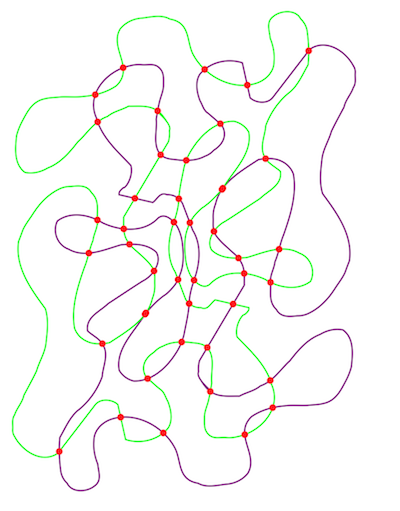

ClippingBezier
===========

This library adds categories to UIBezierPath to simplify clipping a single closed UIBezierPath with another
closed or unclosed UIBezierPath.


## Building the framework

This library will generate a proper static framework bundle that can be used in any iOS7+ project.

## Including in your project

1. Link against the built framework and the included PerformanceBezier framework
2. Add "-ObjC++ -lstdc++" to the Other Linker Flags in the project's Settings
3. #import <PerformanceBezier/PerformanceBezier.h>
4. #import <ClippingBezier/ClippingBezier.h>

## Example

```
UIBezierPath* aClosedPath = /* some path */;
UIBezierPath* scissorPath = /* some other path */;

NSArray* subshapes = [aClosedPath uniqueShapesCreatedFromSlicingWithUnclosedPath:scissorPath];
for(DKUIBezierPathShape* shape in subshapes){
    UIBezierPath* aClosedPathSlice = shape.fullPath;
}
```

## Screenshots

Find intersections between two UIBezierPaths:



Or find the component shapes generated from two path's intersections


